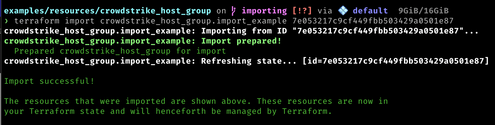
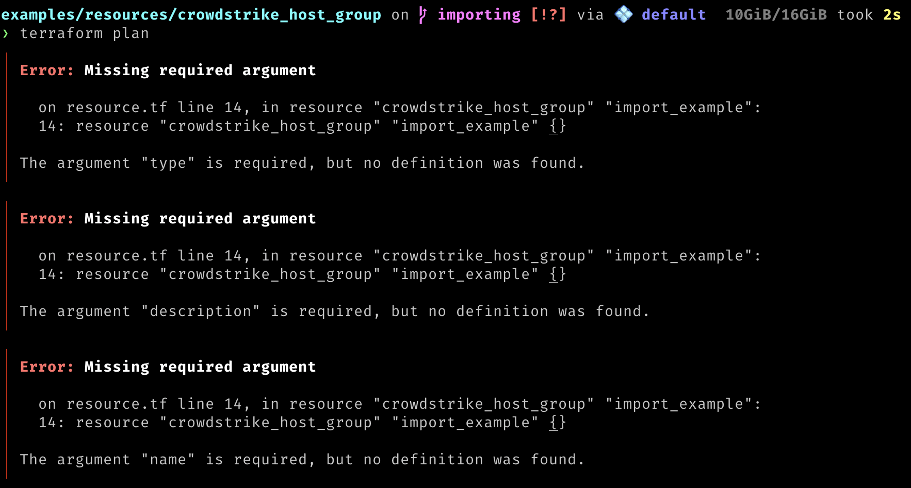
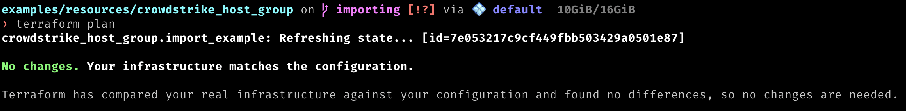

# Importing CrowdStrike Resources

You can start managing existing CrowdStrike resources with terraform by importing resources into terraform state. This guide will go over two different methods of importing CrowdStrike resources into terraform. 

The examples below will show how to import a CrowdStrike Host Group resource, but the same process can be used for other CrowdStrike resources.

## Importing a Single Resource

This example will be importing a single CrowdStrike Host Group named `import_example`.

First create a terraform file that will contain the imported resource, or use an existing file. In the terraform file create a resource block for the resource you want to import. 
```terraform
terraform {
  required_providers {
    crowdstrike = {
      source = "registry.terraform.io/crowdstrike/crowdstrike"
    }
  }
}

provider "crowdstrike" {
  cloud = "us-2"
}

resource "crowdstrike_host_group" "import_example" {}

```

Next, obtain the ID of the resource you want to import. You can obtain the ID by using the CrowdStrike API or, in the CrowdStrike console go to the host group you want to import and copy the ID from the URL.

For example, if the URL is `https://falcon.us-2.crowdstrike.com/hosts/groups-new/edit/7e053217c9cf449fbb503429a0501e87` then the ID is `7e053217c9cf449fbb503429a0501e87`.

At this point, you can import the resource into terraform state by running the following command:
```bash
terraform import crowdstrike_host_group.import_example 7e053217c9cf449fbb503429a0501e87
```

You should see an output similar to the following:



Now the resource is imported into terraform state, and you can manage it with terraform. However, you are not yet ready to run terraform. Running `terraform plan` at this stage will result in errors similiar to the ones shown below.



These errors occur because although the resource is imported into terraform state, the configration block remains empty in the terraform file.


```terraform
resource "crowdstrike_host_group" "import_example" {}
```

The next step is to fill in the resource block with the desired configuration. Luckily there is a command that will generate the configuration for you based on the state.

Running the following command will output what terraform thinks the resource should look like based on state.
```bash
terraform state show crowdstrike_host_group.import_example
```

You can copy the configuration and paste it into the resource block in the terraform file. 

```terraform
# crowdstrike_host_group.import_example:
resource "crowdstrike_host_group" "import_example" {
    assignment_rule = "tags:'SensorGroupingTags/molecule'+os_version:'RHEL 9.4'"
    description     = "example importing resources"
    id              = "7e053217c9cf449fbb503429a0501e87"
    name            = "import_example"
    type            = "dynamic"
}
```

Remove the `id` field from the configuration as it is not needed. 

Now run `terraform plan`



If the output shows no changes, your configuration now matches the remote state. If you have errors or changes you can make the necessary modifications to the configuration and run `terraform plan` again until the output shows what you expect.   


## Using the Import block

Starting in terraform version `1.5.0` and later, you can use the `import` block to import resources into terraform state and generate a configuration file for you.

Hashicorp has a [guide](https://developer.hashicorp.com/terraform/language/import) on how to use the import block.

We will use this method to import two CrowdStrike Host Groups named `import_example` and `import_example2`.

First obtain the ID of the resources you want to import. You can obtain the ID by using the CrowdStrike API or, in the CrowdStrike console go to the host group you want to import and copy the ID from the URL.

For example, if the URL is `https://falcon.us-2.crowdstrike.com/hosts/groups-new/edit/7e053217c9cf449fbb503429a0501e87` then the ID is `7e053217c9cf449fbb503429a0501e87`.

Create a `imports.tf` file and add a block for each resource you want to import. 

```terraform
terraform {
  required_providers {
    crowdstrike = {
      source = "registry.terraform.io/crowdstrike/crowdstrike"
    }
  }
}

provider "crowdstrike" {
  cloud = "us-2"
}

import {
    to = crowdstrike_host_group.import_example
    id = "7e053217c9cf449fbb503429a0501e87"
}

import {
    to = crowdstrike_host_group.import_example2
    id = "6c71bec43b5b46b5af52756b6b10880c"
}
```

This will import two CrowdStrike Host Groups named `import_example` and `import_example2`.

Now we can use the `-generate-config-out` flag when running terraform plan to generate a configuration file for the imported resources.

```bash
terraform plan -generate-config-out=generated_host_groups.tf
```

This will generate a file named `generated_host_groups.tf` that contains the configuration for the imported resources.

```terraform
# __generated__ by Terraform
# Please review these resources and move them into your main configuration files.

# __generated__ by Terraform from "7e053217c9cf449fbb503429a0501e87"
resource "crowdstrike_host_group" "import_example" {
  assignment_rule = "tags:'SensorGroupingTags/molecule'+os_version:'RHEL 9.4'"
  description     = "example importing resources"
  host_ids        = null
  hostnames       = null
  name            = "import_example"
  type            = "dynamic"
}

# __generated__ by Terraform from "6c71bec43b5b46b5af52756b6b10880c"
resource "crowdstrike_host_group" "import_example2" {
  assignment_rule = null
  description     = "importing example"
  host_ids        = null
  hostnames       = ["00ff4c85-4136-4095-9772-fa801196d8f1", "EC2AMAZ-0L3TP64", "EC2AMAZ-AVF9PCV", "EC2AMAZ-KVQAOAL", "d4581a1b-6d6b-40fc-8400-d1c9c0c1ebdc"]
  name            = "import_example2"
  type            = "static"
}
```

After reviewing the resources in the generated file, you can move the resources into your main configuration files.

Once done you are ready to run `terraform plan/apply`. This will import the resources into terraform state and start managing them with terraform.

> [!IMPORTANT]
> Review the plan carefully before applying to ensure that the changes are what you expect.


